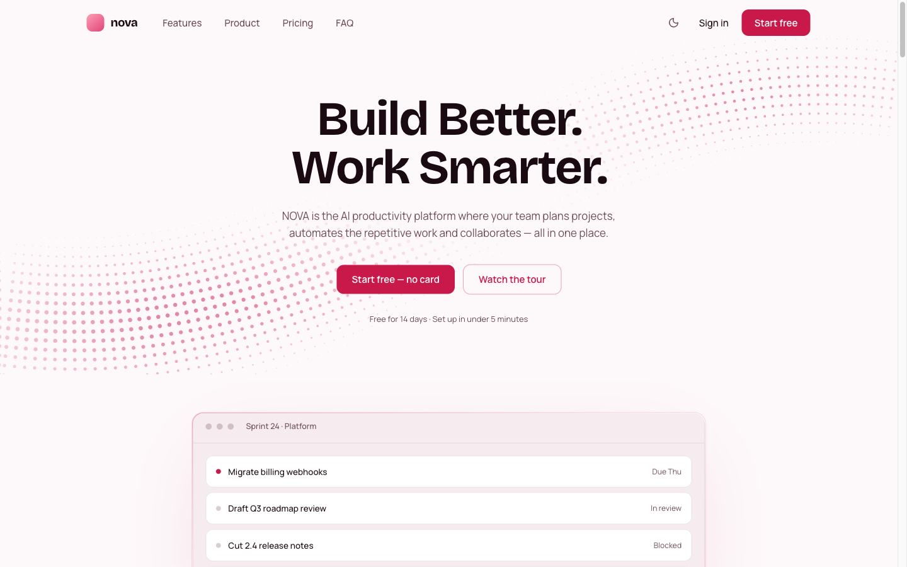
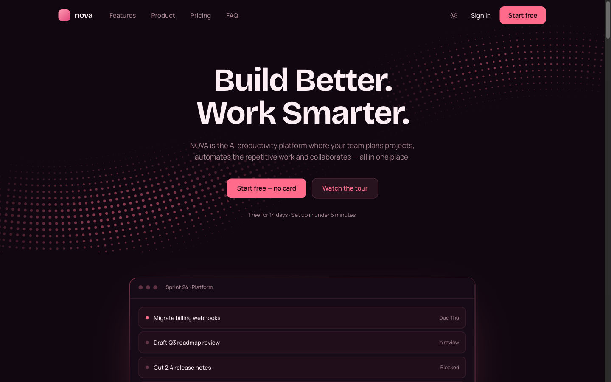
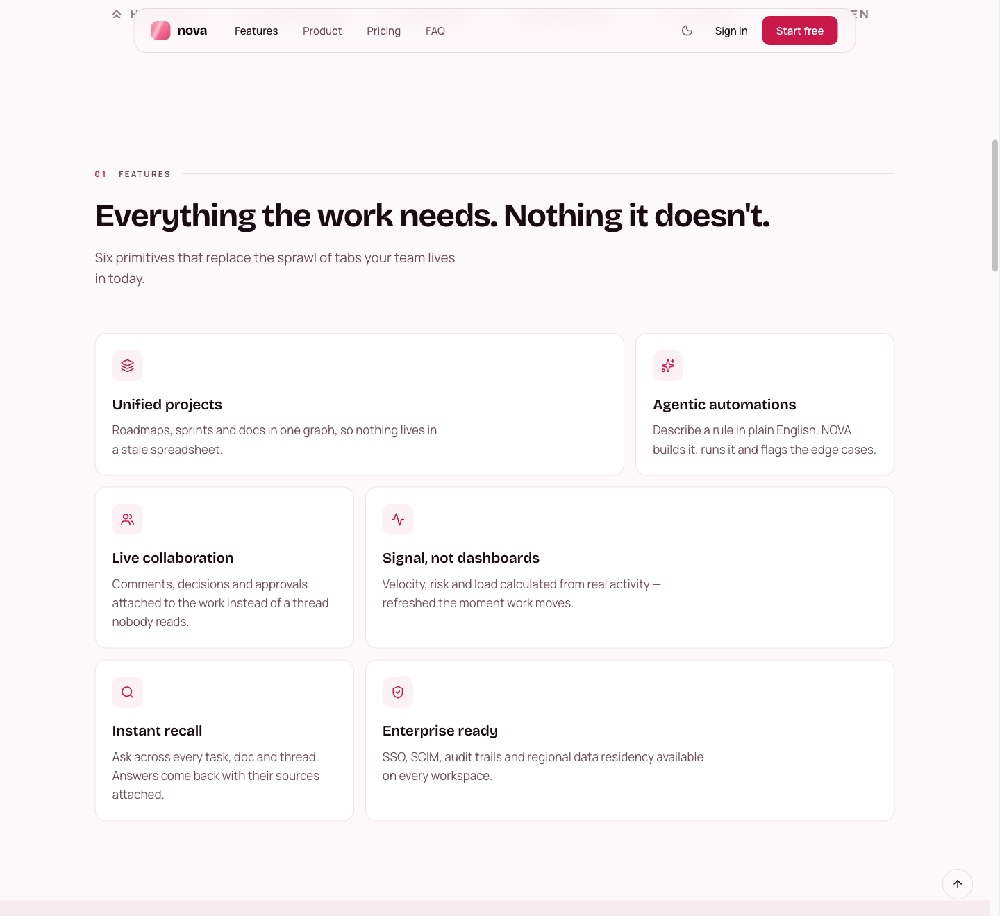
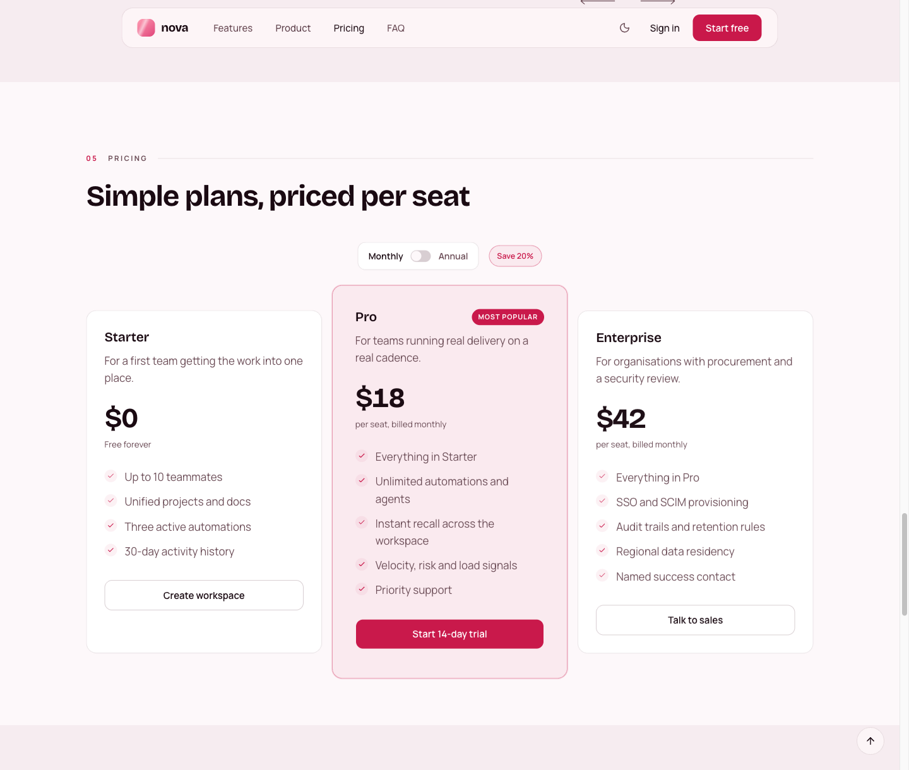
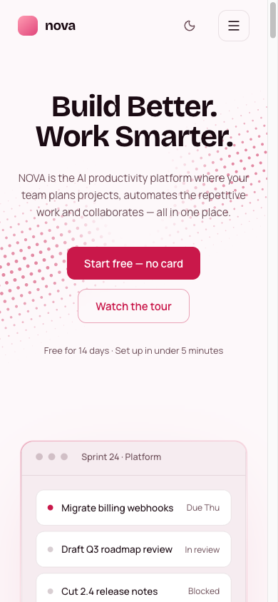
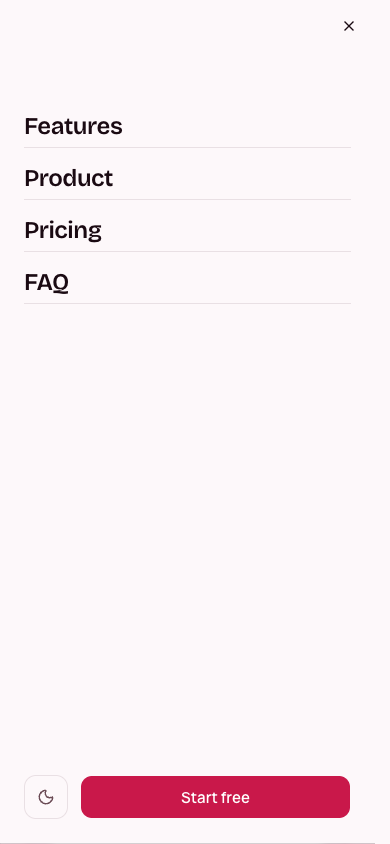

# NOVA — AI Productivity Platform

A landing page for a made-up company called NOVA, an AI productivity platform
for teams. It is one page with thirteen sections, works on phones through to
desktops, and has a light and a dark theme.

**Live demo:** https://nova-ai-productivity-sahildev.vercel.app/

**Repo:** https://github.com/sahil-dev28/nova-ai-productivity-

For why things are built the way they are — the colours, the navbar, the
animation, and the problems I hit — see [EXPLANATION.md](./EXPLANATION.md).

---

## Technologies used

| Tool                  | What it does here                                       |
| --------------------- | ------------------------------------------------------- |
| Next.js 16 + React 19 | App Router. The whole page builds to static HTML        |
| TypeScript            | Types on all the content data and component props       |
| Tailwind CSS v4       | Styling. Config lives in CSS, so tokens sit in one file |
| shadcn/ui + Radix     | Button, dialog, accordion, tabs, switch, sheet          |
| react-hook-form + zod | Form state and validation                               |
| Embla Carousel        | The testimonial slider                                  |
| next-themes           | Light and dark switching                                |
| react-countup         | The statistics counters                                 |
| lucide-react          | Icons                                                   |

No animation library — the motion is written by hand. There is a section on
why in EXPLANATION.md.

## Features

**Sections:** Nav, Hero, Trusted By, Features, Product, How It Works,
Statistics, Solutions, Testimonials, Pricing, FAQ, Final CTA, Footer.

**Interactions:**

- Responsive navigation, with a hamburger menu on mobile
- Smooth scrolling, and the nav link for the section you are in is highlighted
- FAQ accordion
- Hover effects on buttons and cards
- All navigation links work

**Extras:**

- Light and dark mode
- Statistics that count up when you scroll to them
- Scroll animations
- Testimonial carousel
- Monthly / annual pricing toggle
- A sign-up modal on the Get started button
- Newsletter with email validation in the footer
- Back-to-top button

**Accessibility:** one `h1` with no skipped levels, a skip link, visible focus
rings, 44px touch targets, `aria-expanded` on the accordion and hamburger,
`aria-current` on the active nav link, a focus-trapped modal that returns
focus on close, and form errors linked to their inputs. `pnpm lint` runs the
full `jsx-a11y` rule set.

## Installation

```bash
pnpm install
pnpm dev      # http://localhost:3000
```

Other commands:

```bash
pnpm build    # production build
pnpm lint     # eslint, including jsx-a11y
```

If you deploy it, set `NEXT_PUBLIC_SITE_URL` to that address. The sitemap,
robots file and social card need a full URL to work. On Vercel it picks up the
deployment URL on its own.

## Screenshots

**Hero — light and dark**

The dotted wave is drawn in code rather than being an image. The theme toggle
sits in the navbar.

| Light | Dark |
| --- | --- |
|  |  |

**Features**

Six tiles on a three column grid, with wide and narrow tiles alternating so
the block does not read as a plain grid.



**Pricing**

Monthly and annual toggle. Starter and Enterprise are the same height and the
Pro plan is deliberately taller.



**Mobile**

At 390px wide. The nav links move into a slide-out menu.

| Hero | Menu open |
| --- | --- |
|  |  |

## AI tools used

I used Claude Code while building this. Mostly for working through bugs,
checking my reasoning on layout and accessibility, and writing repetitive
parts faster.

The design decisions are mine — the colours, the navbar behaviour, the wave in
the hero, the testimonial layout, and how the sections are structured. I
reviewed everything that went in and I can explain any of it. There is more
detail on this in EXPLANATION.md.
